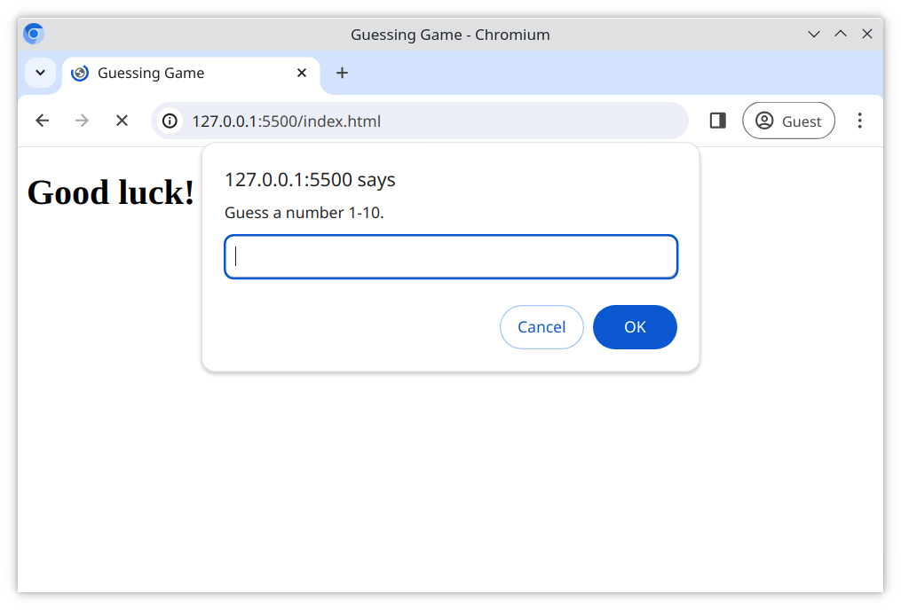
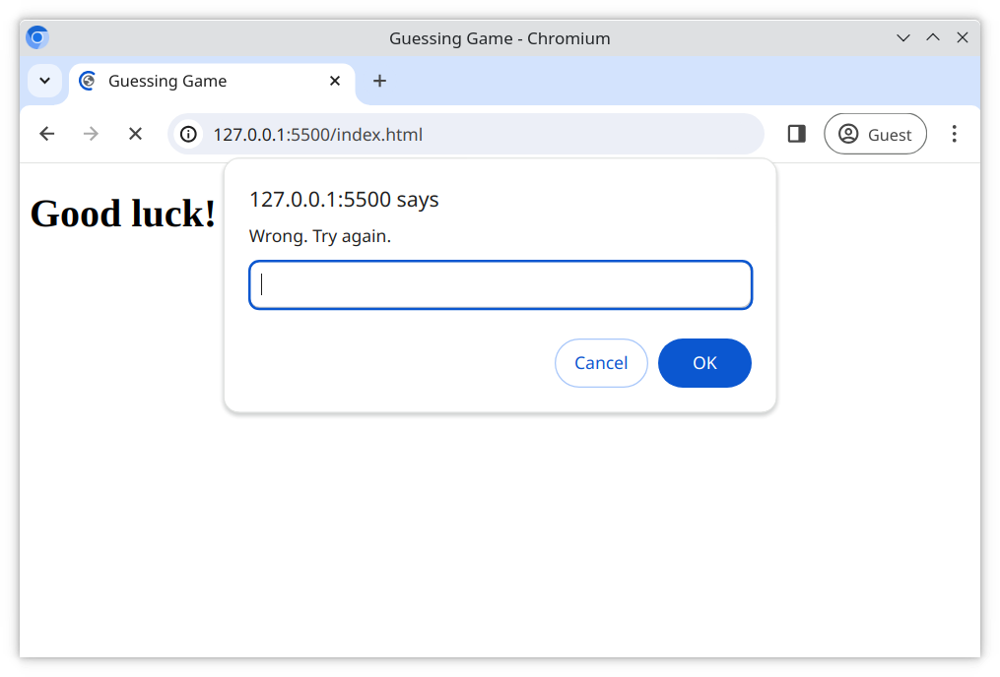
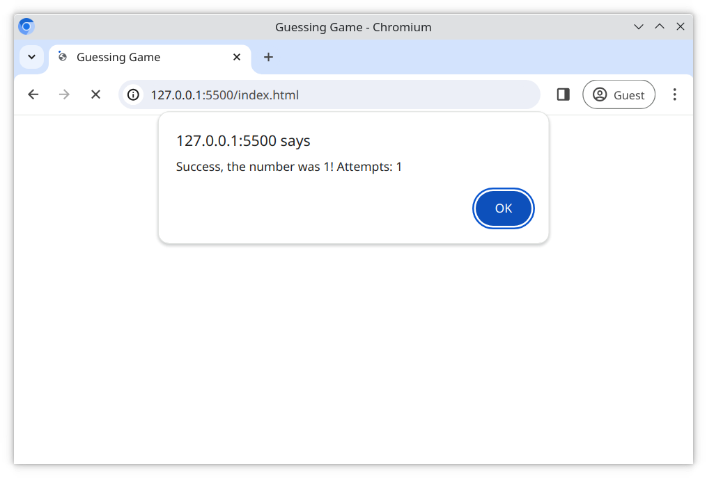
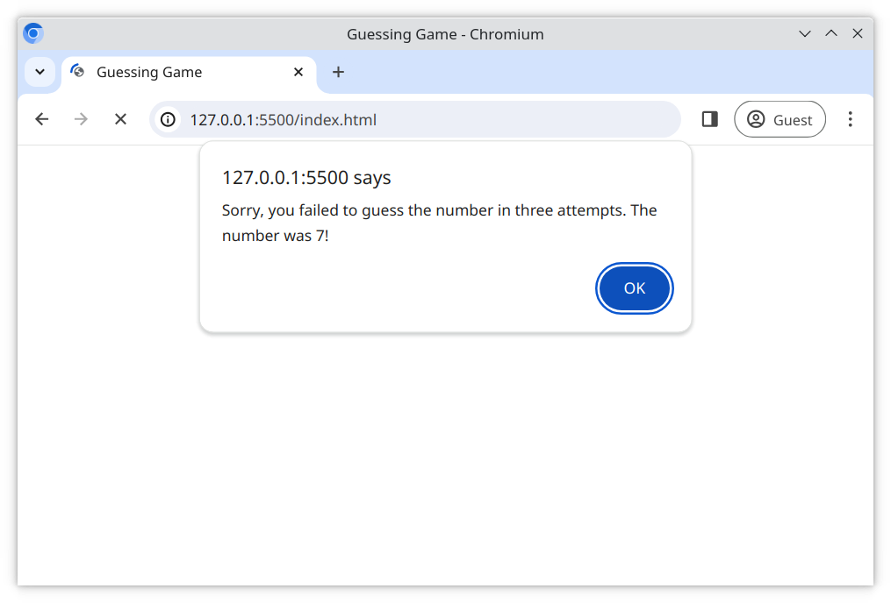

# The Guessing Game

Here you can practice adding JavaScript to a webpage, as well as working with the browser's `window` object by creating a simple game.

## Task

Create a game which generates a random integer between 1 and 10. The user has 3 chances to guess the number. If they don't guess the number in 3 tries, they fail the game.

- Using the `<script>` tag, link the external JavaScript file [index.js](/index.js) with the [index.html](/index.html) file
- Write your JavaScript in the [index.js](/index.js) file
- Meet the requirements outlined below

## Requirements

- Use the **window** `alert` and `prompt` functions to display and capture information

- Create a function named `randomNumber` which;

  - takes in no arguments
  - returns a random integer between **1** and **10**

- Create a function named `guessingGame` which;

  - takes in no arguments
  - doesn't return anything
  - calls `randomNumber` to get a random number
  - keeps track of the amount of guesses with another variable
  - `prompt` the user to guess a number
  - if the user is incorrect, `prompt` a new guess until they tried 3 times
  - if the user is correct, `alert` a congratulation
  - if the user guessed incorrectly 3 times, tell them the correct number with an `alert`

- Call `guessingGame()` to initialize the application

### Reference Images

#### Starting the game

#### User guessed incorrectly

#### User wins the game

#### User lost

[//]: # (autograding info start)
#  Results
> ⌛ Give it a minute. As long as you see the orange dot  on top, CodeBuddy is still processing. Refresh this page to see it's current status.
>
> This is what CodeBuddy found when running your code. It is to show you what you have achieved and to give you hints on how to complete the exercise.

### Guessing Game

|                 Status                  | Check                                                                                    |
| :-------------------------------------: | :--------------------------------------------------------------------------------------- |
|  | `randomNumber` returns a random number between 1 and 10 |
|  | three atemps should be available |
|  | success message is displayed upon correct guess |
|  | failure message is displayed upon three incorrect guesses |

[🔬 Results Details](../../actions)
[🐞 Tips on Debugging](https://github.com/DCI-EdTech/autograding-setup/wiki/How-to-work-with-CodeBuddy)
[📢 Report Problem](https://docs.google.com/forms/d/e/1FAIpQLSfS8wPh6bCMTLF2wmjiE5_UhPiOEnubEwwPLN_M8zTCjx5qbg/viewform?usp=pp_url&entry.652569746=spa-browser-guessing-game)

[//]: # (autograding info end)