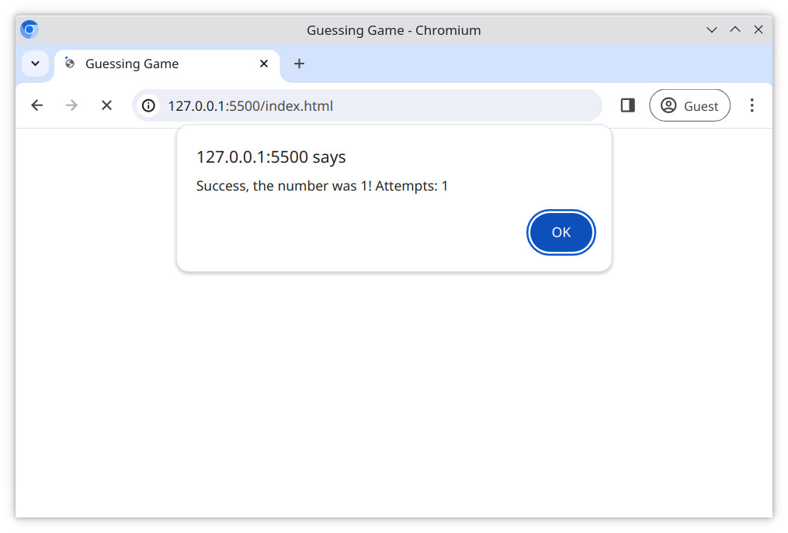

# Das Ratespiel

Hier kannst du üben, JavaScript zu einer Webseite hinzuzufügen und mit dem `window`-Objekt des Browsers zu arbeiten, indem du ein einfaches Spiel erstellst.

## Aufgabe

Erstelle ein Spiel, das eine zufällige Ganzzahl zwischen 1 und 10 generiert. Der Benutzer hat 3 Versuche, die Zahl zu erraten. Wenn er die Zahl nicht innerhalb von 3 Versuchen errät, verliert er das Spiel.

- Verwende den `<script>`-Tag, um die externe JavaScript-Datei [index.js](/index.js) mit der [index.html](/index.html) Datei zu verlinken
- Schreibe dein JavaScript in der [index.js](/index.js) Datei
- Erfülle die unten aufgeführten Anforderungen

## Anforderungen

- Verwende die **window** `alert` und `prompt` Funktionen, um Informationen anzuzeigen und zu erfassen

- Erstelle eine Funktion namens `randomNumber`
    - nimmt keine Argumente an
    - gibt eine zufällige Ganzzahl zwischen __1__ und __10__ zurück

- Erstelle eine Funktion namens `guessingGame`
    - nimmt keine Argumente an
    - gibt nichts zurück
    - ruft `randomNumber` auf, um eine Zufallszahl zu erhalten
    - behalte die Anzahl der Vermutungen mit einer anderen Variable im Auge
    - fordere den Benutzer mit `prompt` auf, eine Zahl zu erraten
    - wenn der Benutzer falsch liegt, fordere mit `prompt` eine neue Vermutung an, bis sie 3 Mal versucht haben
    - wenn der Benutzer richtig liegt, sende eine Glückwunschmeldung mit `alert`
    - wenn der Benutzer 3 Mal falsch geraten hat, teile ihnen die richtige Zahl mit einem `alert` mit

- Rufe `guessingGame()` auf, um die Anwendung zu initialisieren

### Referenzbilder

#### Spiel starten

#### Benutzer hat falsch geraten

#### Benutzer gewinnt das Spiel

#### Benutzer verliert

